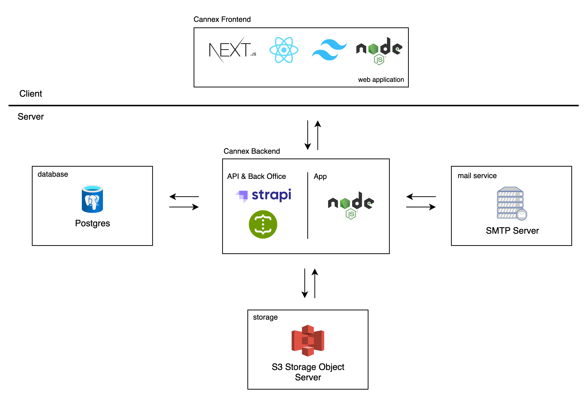

# Tech Stack Diagram

<figure><figcaption></figcaption></figure>

### Frontend

* **React.js** → Core frontend library for building the user interface.
* **TailwindCSS** → Utility-first CSS framework for styling the frontend.
* **Node.js (Frontend runtime)** → Used for SSR/Next.js build or frontend tooling.
* **API Communication** → The frontend communicates with the backend services through REST APIs.

### Backend (Application Layer)

* **Node.js (Backend runtime)** → Runs server-side application logic.
* **Strapi** → Headless CMS for managing content (e.g., events, newsrooms, contact forms).
* **Swagger / OpenAPI** → API documentation and interface to interact with backend APIs.

### Databases & Storage

* **Postgres (Database)** → Stores structured data such as users, events, newsrooms, and contact form submissions.
* **AWS S3 (Object Storage)** → Stores static assets and media files (e.g., images, documents).

### Services / Integrations

* **Authentication & API Management** handled at the backend (Strapi + Node.js).
* **Email Service** (not shown in the diagram but implied from contact form flows).
